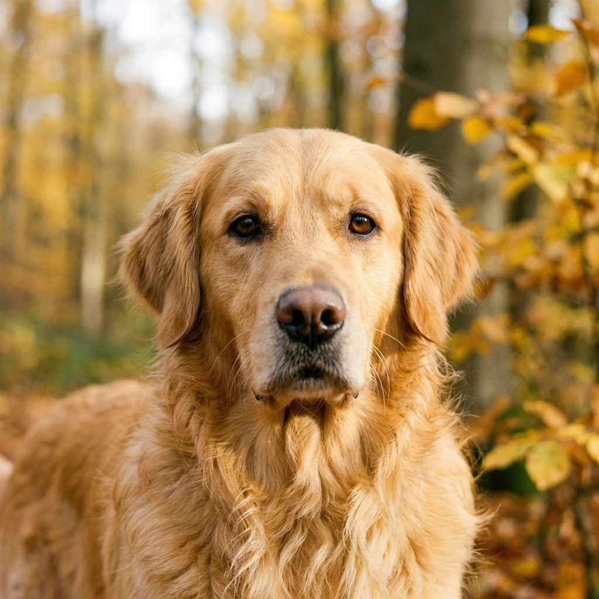

# Image Recognition Tool Walkthrough

The Image Recognition tool has been successfully implemented using `torchvision`'s ResNet-50 model.

## Features
- **Local AI Inference**: Uses a pre-trained ResNet-50 model to classify images.
- **Top 5 Predictions**: Displays the most likely labels with confidence scores.
- **Robust Image Processing**: Handles RGB conversion and standard ImageNet normalization.

## Changes Made
- Created `006_image-recognition/` directory.
- Implemented `recognizer.py` utilizing `torch`, `torchvision`, and `PIL`.
- Configured local environment with `Numpy 1.x` for compatibility.

## Verification Results

### Success Case
The program correctly identified the sample image provided in the task folder:



**Console Output:**
```text
Loading ResNet-50 model...
Loading image: 006_image-recognition/sample_image.png
Preprocessing image...
Running prediction...
Predictions:
1. golden retriever: 39.40%
2. flat-coated retriever: 1.24%
3. soccer ball: 0.80%
4. Greater Swiss Mountain dog: 0.78%
5. tennis ball: 0.72%
```

> [!TIP]
> You can classify any image by running:
> `/Users/jeffzo/projects/practice/AIcoding/VibeCodingWithPython/venv/bin/python3 006_image-recognition/recognizer.py <path_to_image>`
